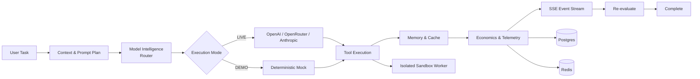

# OrchestraAI — Adaptive Agent Runtime

[](https://github.com/harshpandeyz/OrchestraAI/actions/workflows/ci.yml)
[](LICENSE)
[](Dockerfile)

> **A production-oriented agent runtime that routes tasks to AI models, executes tools safely, learns from outcomes, and streams execution state in real time.**

### Architecture



### What it does

**OrchestraAI** provides a three-panel console:

* **Runs** — task execution and history
* **Agent Workspace** — live execution state
* **Runtime Intelligence** — routing, memory, cost and performance

The backend implements the complete loop:

**Task → Context → Model Routing → Provider → Tools → Memory/Cache → Telemetry → SSE → Re-evaluation → Completion**

LIVE uses real provider calls; DEMO uses an explicitly labelled deterministic mock while keeping the same agent/tool execution flow.

---

## Quick Start

```bash
# Runtime API + SSE
npm start
# → http://localhost:8787

# Console
cd frontend
npm install
npm run dev
# → http://localhost:5173
```

Configure provider credentials directly from:

**Settings → Providers → Test & Save**

Credentials are verified, encrypted at rest, and never rendered again.

---

## Production Stack

```text
┌───────────────────────────────────────────────┐
│                 OrchestraAI                   │
├───────────────────────────────────────────────┤
│ Console + API                                 │
│                                               │
│ Model Router ── Provider APIs                 │
│      │                                        │
│ Tool Runtime ── Isolated Sandbox Worker       │
│      │                                        │
│ ┌────────────┐      ┌────────────┐            │
│ │  Postgres  │      │   Redis    │            │
│ │ Durable DB │      │ Queue/Lock │            │
│ └────────────┘      └────────────┘            │
└───────────────────────────────────────────────┘
```

### Deploy

```bash
POSTGRES_PASSWORD=... \
SANDBOX_WORKER_TOKEN=... \
DATA_ENCRYPTION_KEY=... \
FRONTEND_ORIGIN=https://console.example \
docker compose -f deploy/docker-compose.yml up --build -d
```

**Production includes:**

* PostgreSQL — durable application state
* Redis — queues, locks and rate limits
* Isolated sandbox worker — customer code execution
* SSE — real-time execution events
* Production authentication and tenant isolation

---

## Testing

```bash
npm run test:all
npm run test:frontend
npm run build:frontend
npm run release:check
```

The test suite covers runtime execution, routing, recovery, persistence, SSRF protection, event contracts, economics, authentication, privacy, analytics and frontend integration.

---

## Key Runtime Guarantees

| Capability        | Implementation                             |
| ----------------- | ------------------------------------------ |
| **Model Routing** | Provider-native model mapping              |
| **Execution**     | Real tools + isolated sandbox              |
| **Streaming**     | SSE with replay, deduplication & reconnect |
| **Memory**        | Cache + durable intelligence               |
| **Recovery**      | Versioned, integrity-checked checkpoints   |
| **Security**      | SSRF protection, auth & tenant isolation   |
| **Economics**     | Provider usage + cost tracking             |
| **Approvals**     | Single-use, scoped approvals               |
| **Persistence**   | PostgreSQL + Redis                         |
| **Modes**         | LIVE + explicit DEMO                       |

---

## Event Pipeline

```text
model.switched
      ↓
tool.completed / tool.failed
      ↓
memory.written
      ↓
cost.updated
      ↓
price.updated
      ↓
SSE → Console
```

The backend uses canonical dotted event names and enforces the event contract so new backend events cannot silently disappear from the UI.

---

## Security & Reliability

* Production authentication fails closed.
* Provider credentials are tenant-specific.
* Customer code never executes inside the API process.
* SSRF protection validates DNS and every redirect hop.
* Destructive or unknown-outcome actions are not blindly retried.
* Checkpoints are integrity-sealed and freshness-checked.
* Corrupt runtime data is quarantined rather than loaded.
* Shutdown drains active work and persists runtime state.

---

## Documentation

| Document                      | Purpose                |
| ----------------------------- | ---------------------- |
| `ARCHITECTURE.md`             | System architecture    |
| `CONTRACTS.md`                | Backend contracts      |
| `MODEL_INTELLIGENCE.md`       | Routing & intelligence |
| `CONTEXT_MEMORY_CACHE.md`     | Context & memory       |
| `FRONTEND.md`                 | Console architecture   |
| `deploy/backup-procedures.md` | Production backups     |

---

### Status

**OrchestraAI is designed as a real end-to-end agent runtime — not a simulated UI.**

Real providers, real tools, real persistence, real event streaming, explicit DEMO mode, and production-boundary tests.
